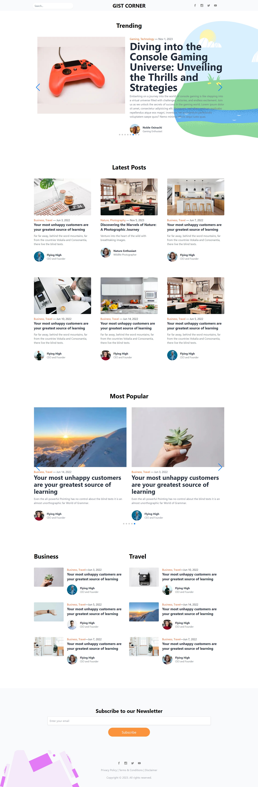

# Worded Next Js

This repository is a clone of [worded.netlify.app](https://worded.netlify.app) owned by [@ChukwuTosin\_](https://github.com/folucode/worded/) implemented using Next.js. It serves as a learning project for JavaScript and Next.js, and aims to replicate the functionalities of the original website.

This project is designed to facilitate learning about TypeScript and Next.js. The goal is to utilize Next.js's modular architecture to implement the functionalities of the original website in an efficient and organized manner. By leveraging the out-of-the-box features provided by Next.js, such as server-side rendering, routing, and component-based development, we can create a scalable and maintainable version of the Worded game!

[](https://blog.vercel.app/)

# Project Background

The project was originally initiated in 2020 as a final project for the _Learn Javascript Online_ training program organized by some UNILAG students during the lockdown period. Having acquired knowledge about Next.js, I now plan to redevelop the project using the Next.js framework along with Typescript. This transition will allow me to leverage the benefits of Next.js, such as server-side rendering, efficient routing, and improved type safety through Typescript. By combining these technologies, I aim to enhance the project's functionality, maintainability, and overall development experience.

# Installation

To run this project locally, please follow these steps:

Clone the repository to your local machine.

```
git clone 'https://github.com/NobleOsinachi/blog.git'
```

Enter the project folder and install the dependencies:

```
npm install
```

Start the development server:

```
npm run dev
```

Open your browser and navigate to [http://localhost:3000](http://localhost:3000) to view the application.

Feel free to reach out to any of us if you have any questions or feedback regarding this project.

# License

This project is licensed under the [MIT License](LICENSE). Feel free to modify and distribute it as per the terms of the license.

# Acknowledgments

I would like to express my gratitude to the creators of the worded project for providing inspiration and serving as a reference for this project.
I learned Javascript from these senior men.

- [Chukwu Tosin](https://github.com/folucode)
- [Akin Aguda](https://github.com/AkinAguda)
- [Olumide (MVP)](https://github.com/onyxolu)

# Disclaimer

This project is a clone and does not claim ownership or rights over the original worded.netlify.app. It is intended for educational purposes only.
